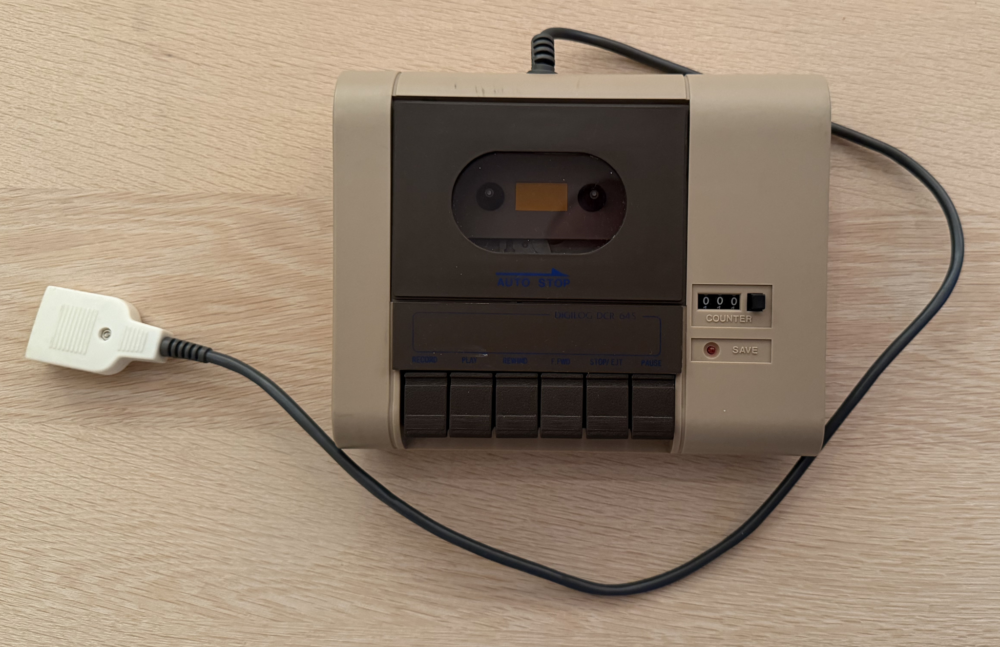
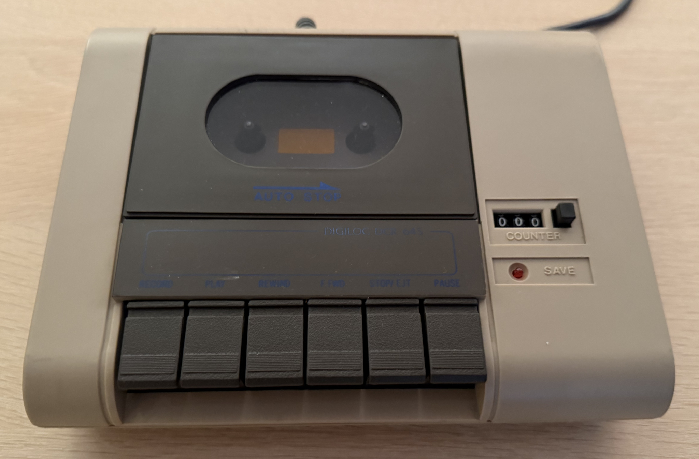
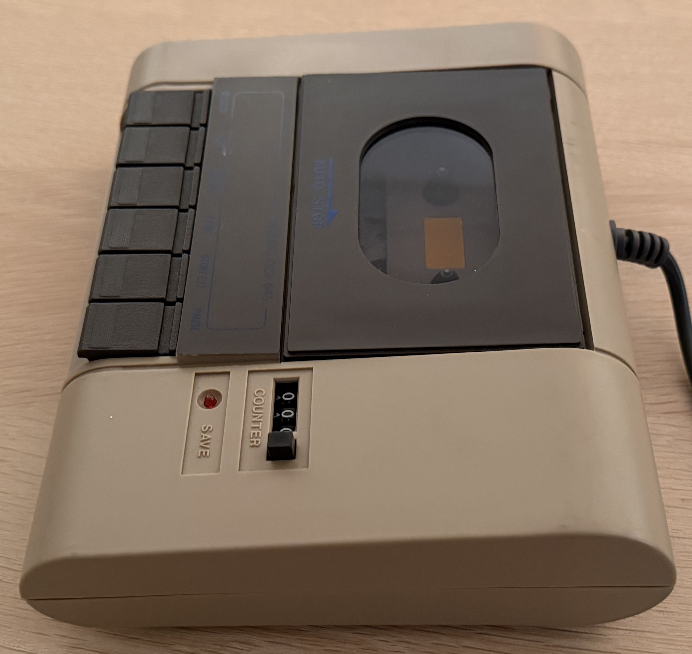
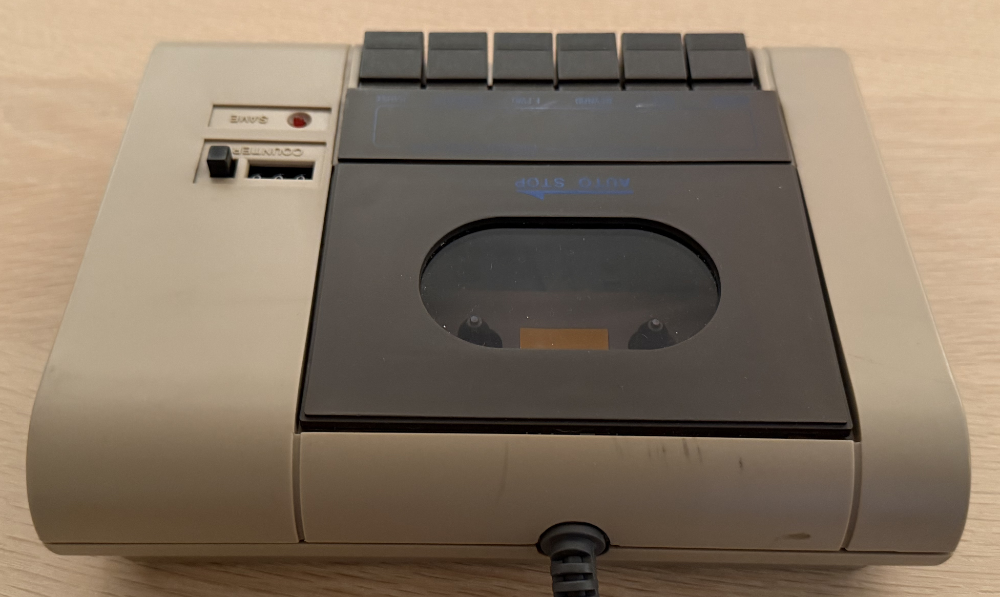
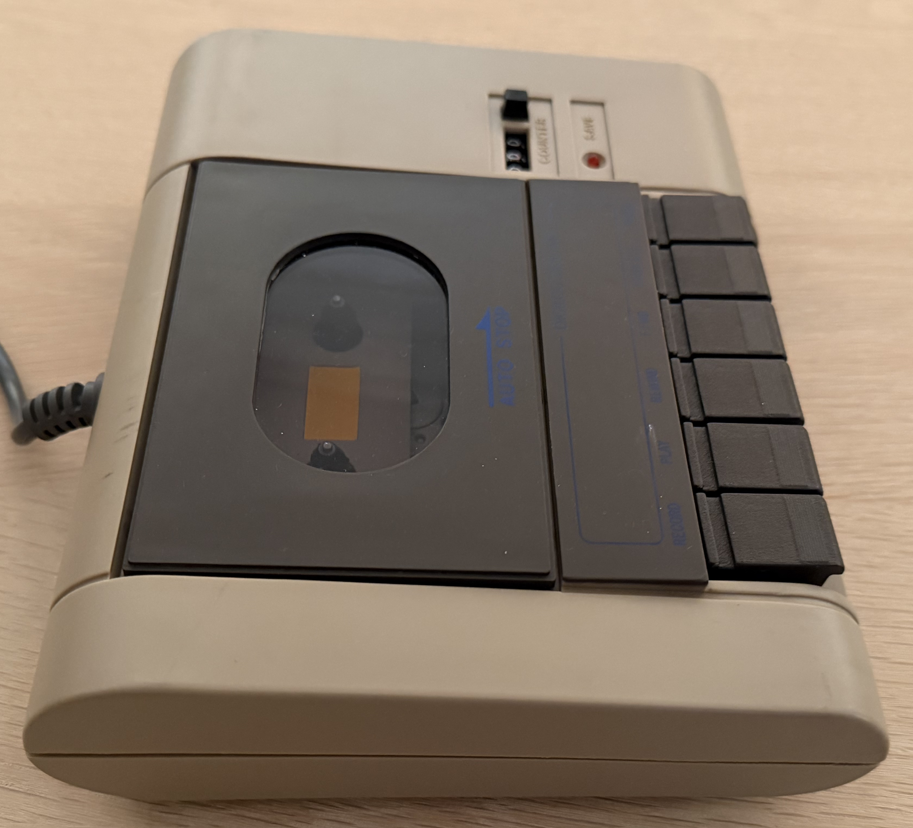
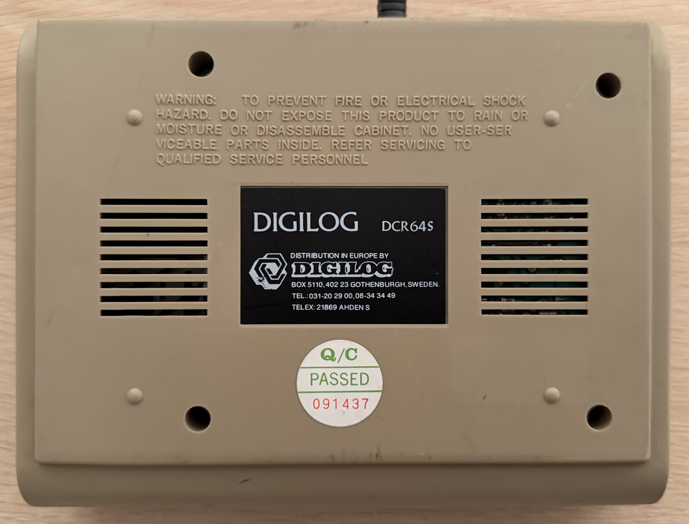
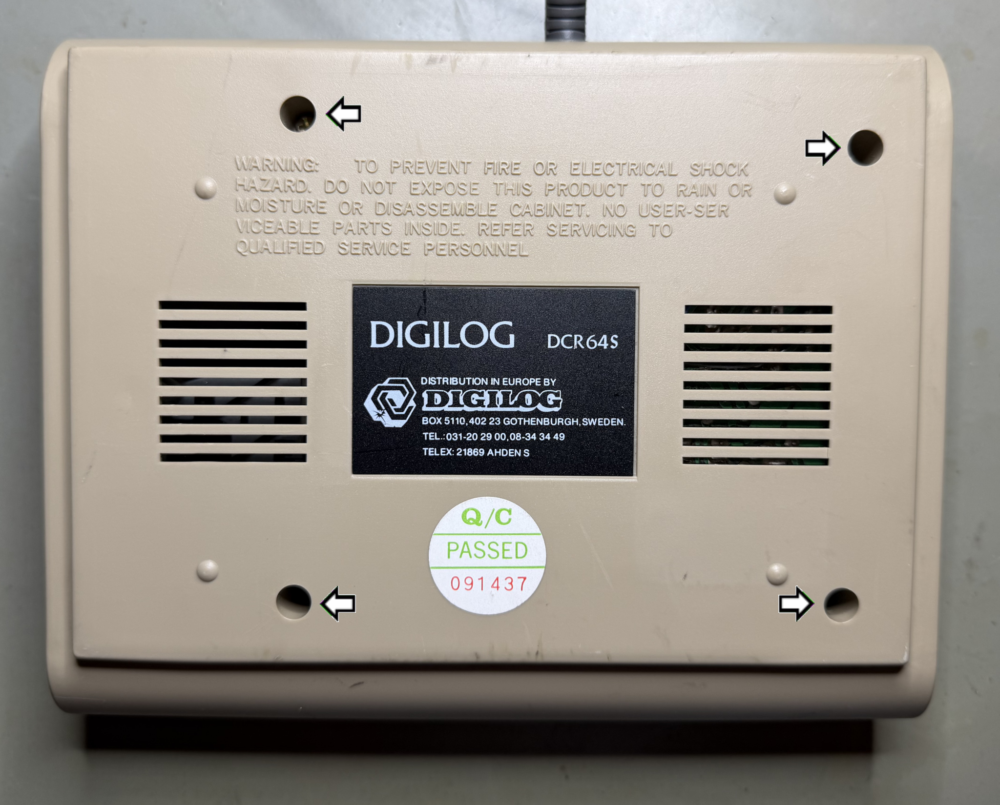
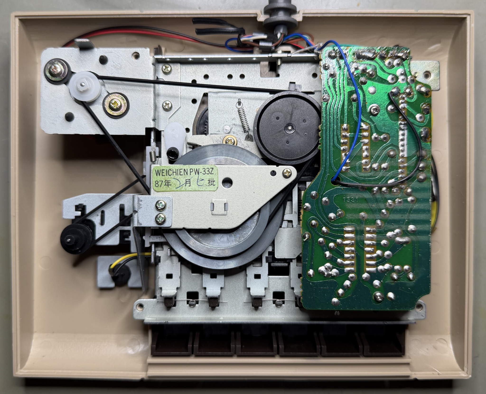
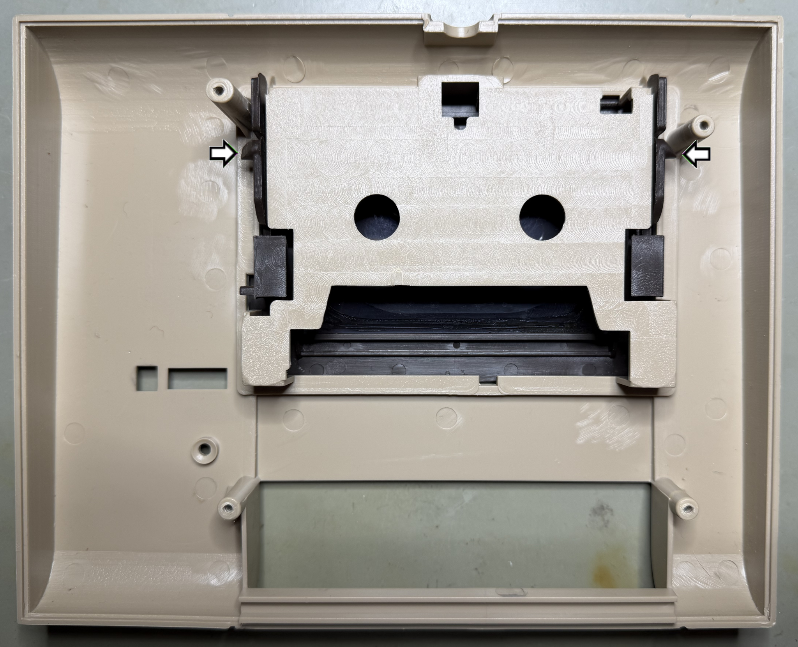

    

# Digilog DCR64S

 

# Table of contents

<!-- TABLE OF CONTENTS -->

TOC - Click to enlarge

  <ul>
    <li>
      <a href="#starting-point">Starting point</a>
    </li>
    <li>
      <a href="#refurbishment-activities">Refurbishment activities</a>
    </li>
    <li>
      <a href="#disassembly">Disassembly</a>
    </li>
    <li>
      <a href="#mainboard">Mainboard</a>
    </li>
    <li>
      <a href="#final-result">Final result</a>
    </li>
  </ul>

<!-- MARK START -->

# Starting point

This is one of many clones of the original Commodore 1530 (C2N) datasette. This particular clone, the Digilog DCR64S, is new to me, but I would expect it to be quite similar as the others. The datasette looks to be in fine condition. There are some spots, and one (and only one) cable burn mark - but I would not expect anything else.

I think that the colour is original, in the sense that it is not yellowed. The dark colour is so even around the whole casing that I can´t think that this is due to any yellowing. All the keys feels responsive, but the top lid is slightly hard to press down after eject. But I think this is normal. There are some oxidation on the pins on the datasette port connector.

All in all, this looks like a fine datasette from the outside. I do not know if it works or not, but that will be investigated during the refurbishment.

DCR64S? What could it mean? My guess is that "DCR" is short for Data Cassette Recorder, and "64", yes, of course refers to the Commodore 64.

Below are some pictures of the datasette before refurbishment.

    
    
    
    
    
    

# Disassembly

Disassembly of the Digilog DCR64S starts with removing the four screws[^1] at the bottom cover.

    

With the screws out of the way, the bottom cover is carefully lifted off. The interior, with its PCB, belts and drive mechanism is exposed. One thing I immediate notice is that the PCB is marked **1531**. This is quite special, since the **1531** PCB is usually found in the original Commodore 1530 (C2N) datasette. So, this is either an original **1531** PCB or a 1:1 clone of it. A picture of the original Commodore **1531** PCB can be seen in the [HOWTO - Datasette head alignment](https://refurbished-commodore.com/datasette-head-alignment) article.

Below is a picture of the interior with the bottom cover removed (Digilog DCR64S).

    

The whole drive mechanism can simply be pulled off from the top cover. **NOTE:** I am not completely sure, but I had to press the EJECT button before I was able to release it. 

    

The top cover can be disassembled further: the top lid can be pushed out from the base. 

<!-- MARK STOP -->

**Footnotes**
[^1]: Phillips pan head (5.2 mm), Sheet metal screw, Fully threaded, Thread diameter: 3.0 mm, Fastener length: 11.5 mm

