

    

 

# Table of contents

<!-- TABLE OF CONTENTS -->

TOC - Click to enlarge

  <ul>
    <li>
      <a href="#starting-point">Starting point</a>
    </li>
    <li>
      <a href="#refurbish-activities">Refurbish activities</a>
    </li>
  </ul>

# Starting point

This internal floppy drive from Panasonic (Model JU-253-033P) was installed in the [Amiga 500 with "special" serial number 1](https://github.com/RefurbishedCommodore/Amiga500/tree/main/Assy%20312510/Artwork%20312513%20REV%206A/Ser.No.%201#readme). It doesn´t look too bad, but I can see that there is quite some dust inside it, and also that the SMD capacitor in the front has spilled all of its dielectrum - making the PCB area a bit of a mess.

It does appear to be ok from a mechanical point of view. I can not see any immediate mechanical damage on the drive - neither external or internal (as much of the internal I can see).

From the starting point I do not know if the drive works or not, but with that "melted" capacitor I have my doubts...

Below are some pictures of the internal disk drive before refurbish.

    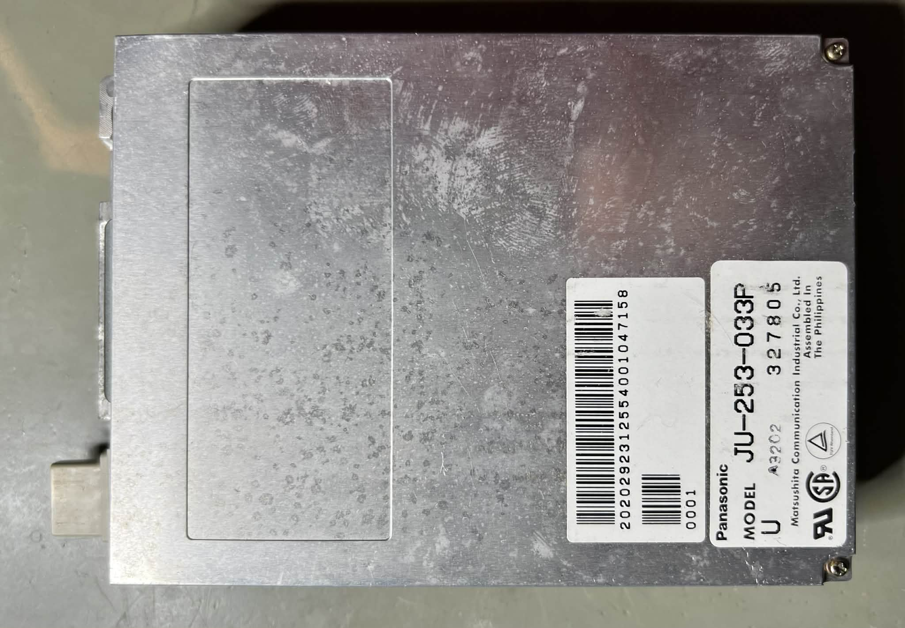
    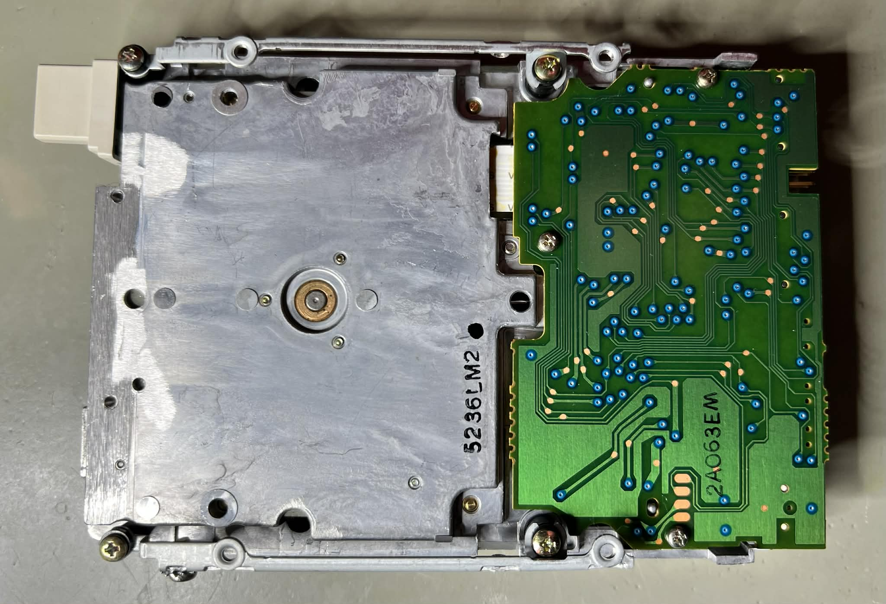
    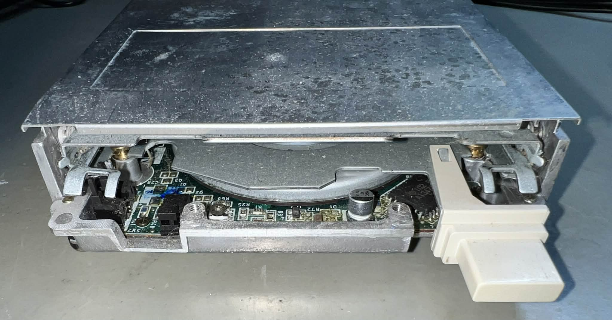
    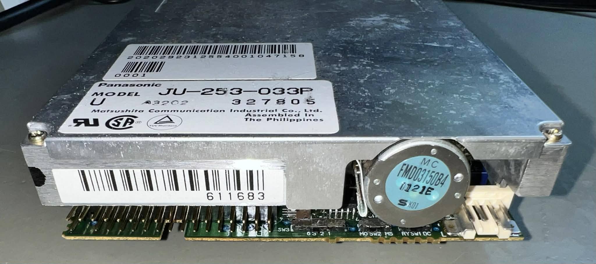
    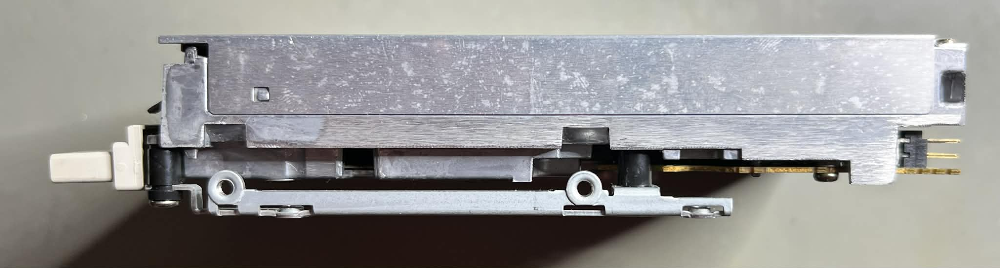
    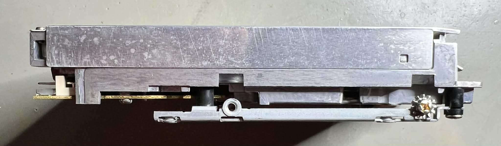

 

# Refurbish activities

The planned refurbishment activites for this Amiga 500 (Order may vary. Several of them in parallell):

- [ ] Clean the interior
- [ ] Clean special parts such as R/W head and stepper motor shaft
- [ ] Refurbish mainboard
- [ ] Testing and validation

The plan can be updated during the refurbishment process. Sometimes I discover areas that needs special attention.
 

 

# Disassembly

Disassembly starts with removing the two small Phillips screws[^1] at the far end of the top lid. See picture below.

    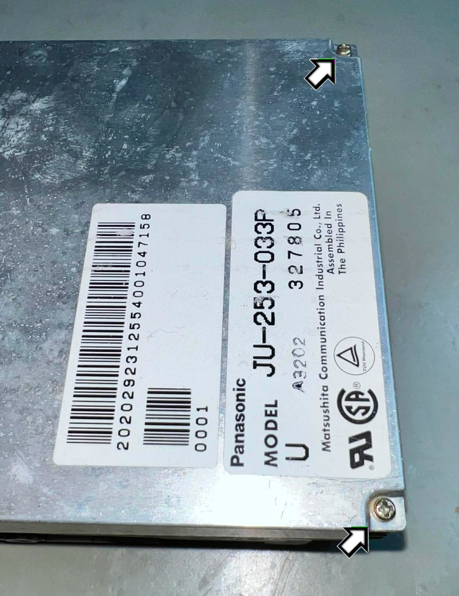

Before the lid can be lifted it needs to be freed from the two small metal tabs located on each side of the drive. See picture below.

    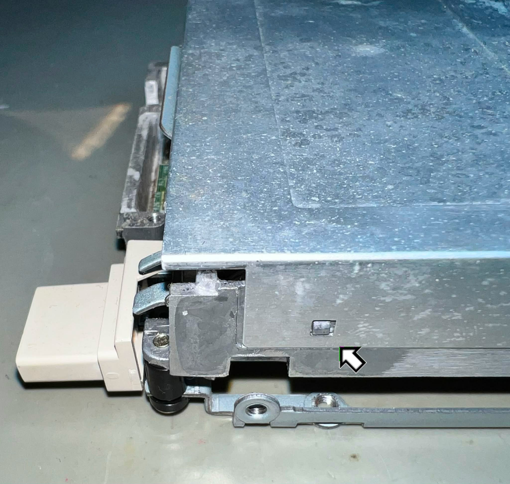

The lid is lifted from the drive and the interior is exposed. There is less dust than I anticipated, but I can see that there is need for some significant cleaning of both PCB and the worm gear.

    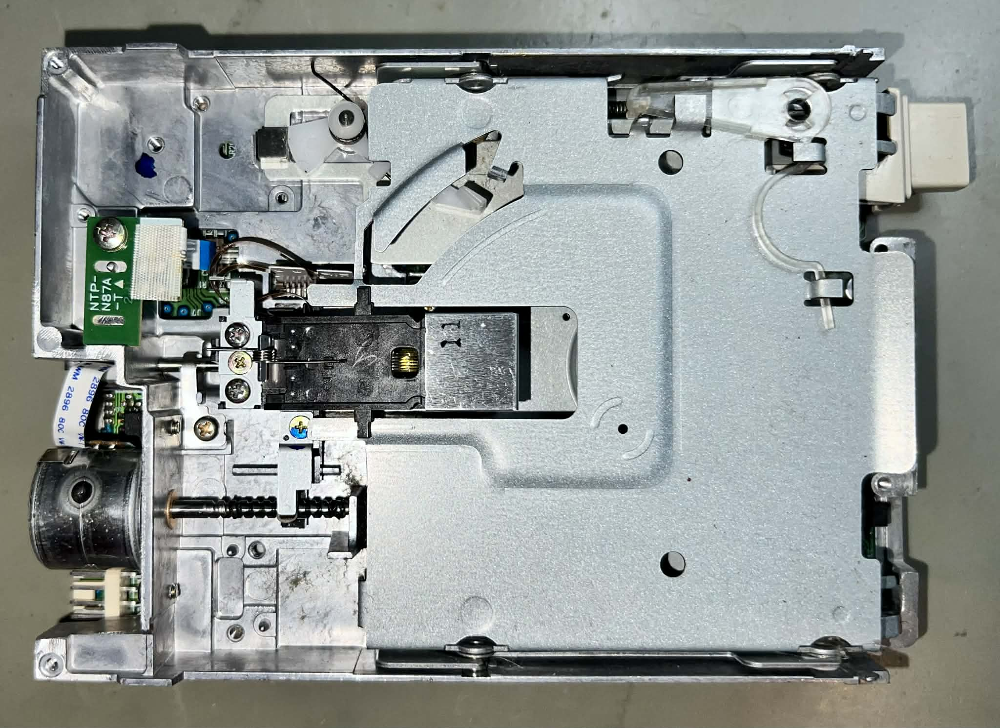

Next step is to remove the eject button which is straightforward, but be careful not to break the brittle plastic. With a thin flat screwdriver the plastic eject button is removed from the little tab holding it in place.

    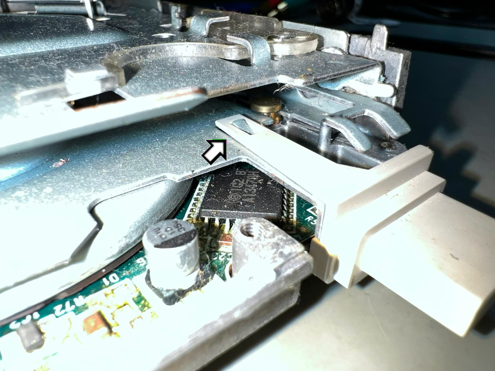

To remove the inner floppy tray the eject button metal tab (now without the plastic button itself) needs to be pressed inwards.

    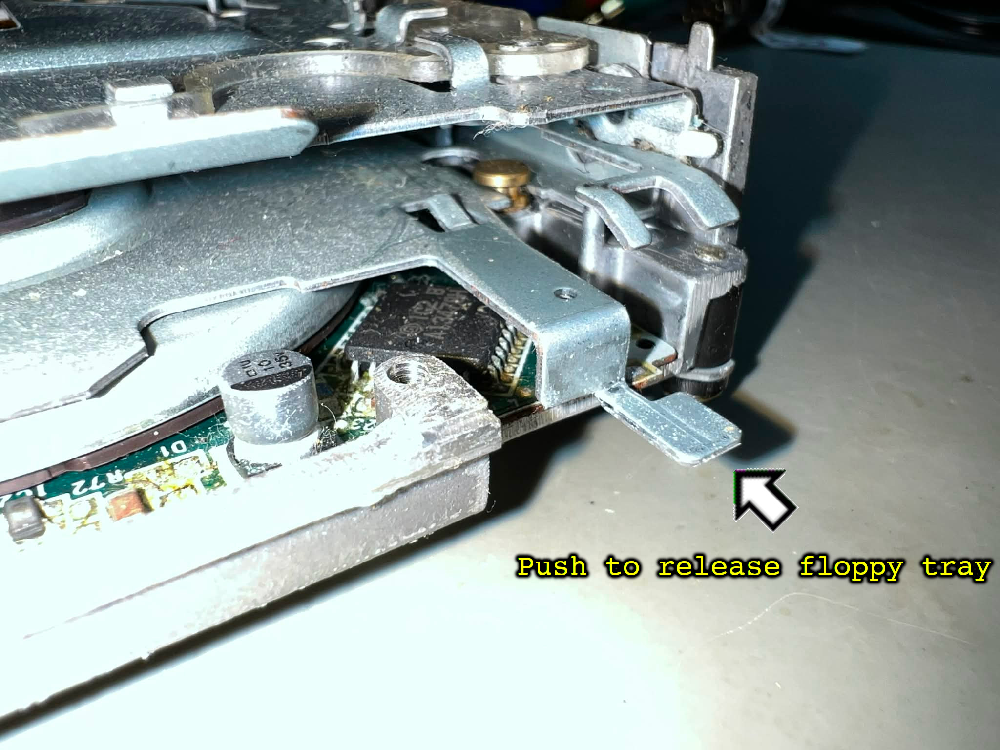

With some care, the front of floppy tray can be lifted from the base. Be VERY careul to not loose any of the small metal wheels (and spacers). These are tiny!

    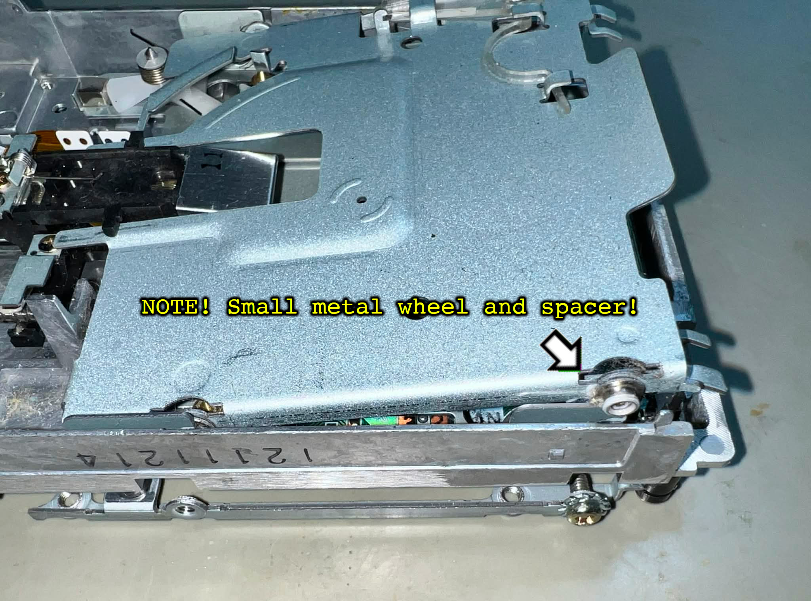

Something to note: there are four metal wheels, but only two spacers. They are distributed as shown in the picture below.

    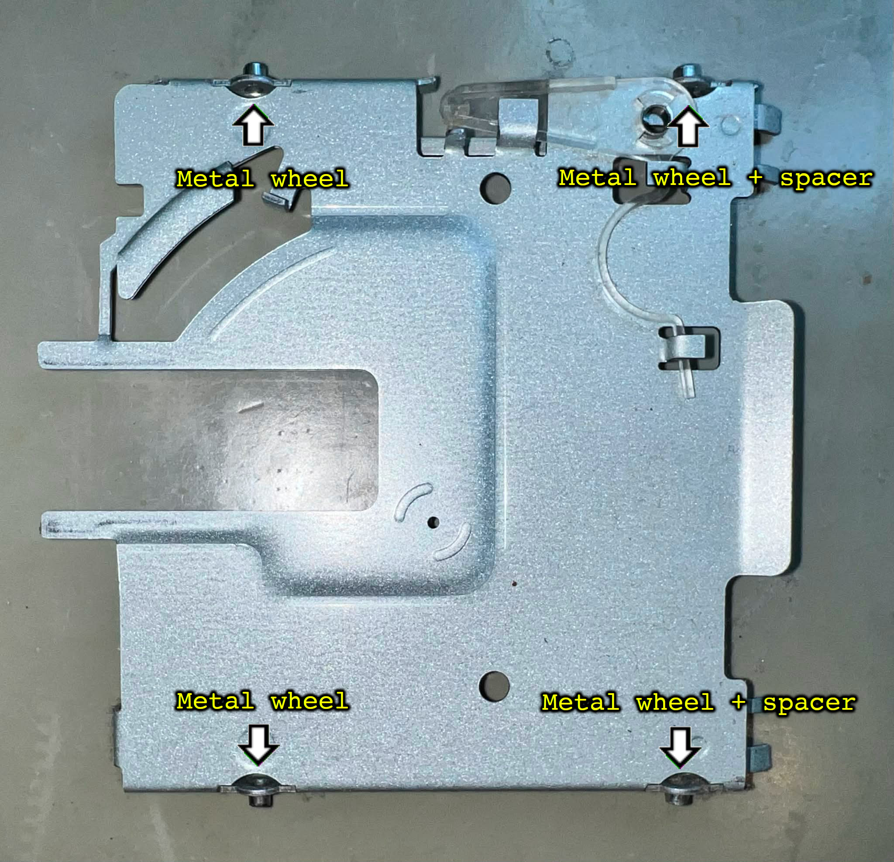
    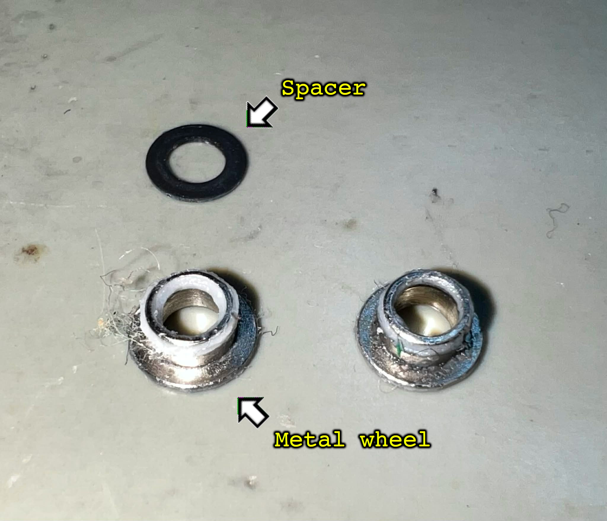

[^1]: Phillips pan head (3.0 mm), Machine screw, Fully threaded, Thread diameter: 2.0 mm, Fastener length: 4.0 mm
