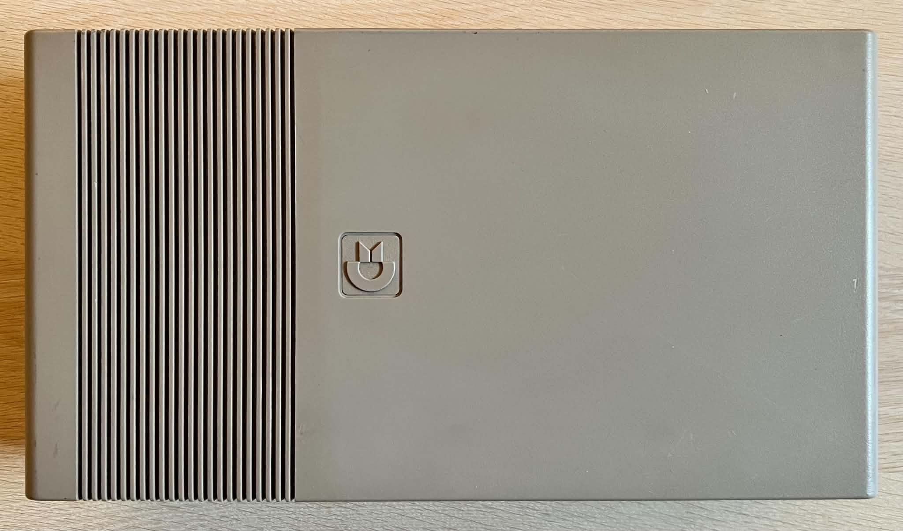
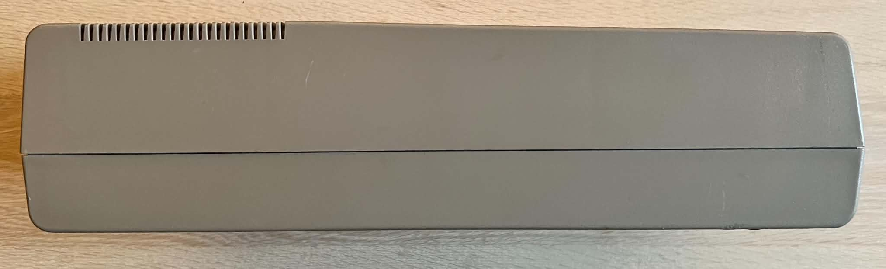
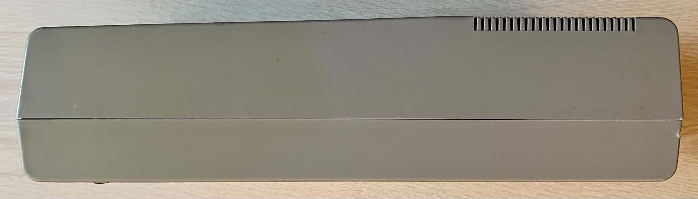
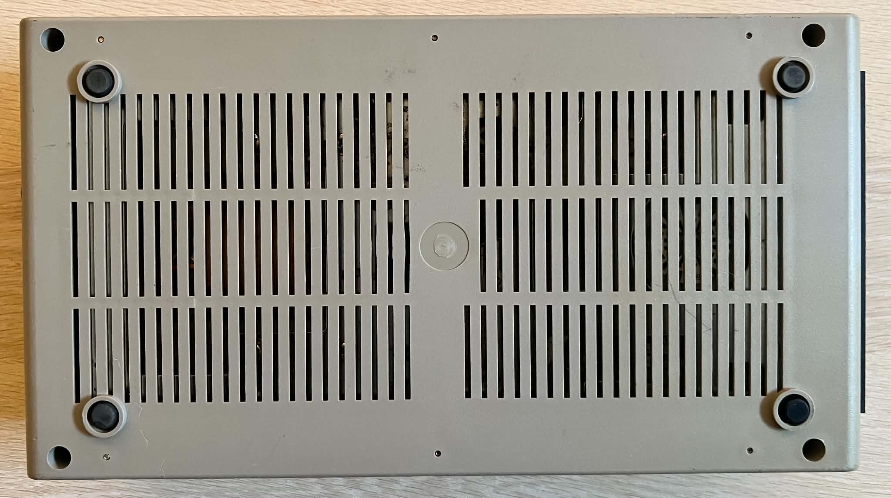
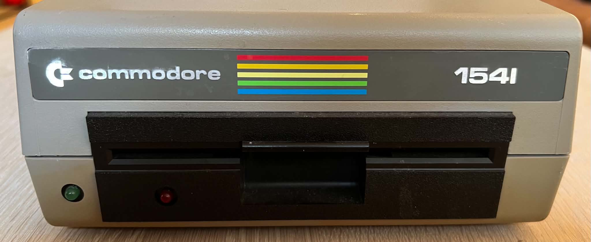
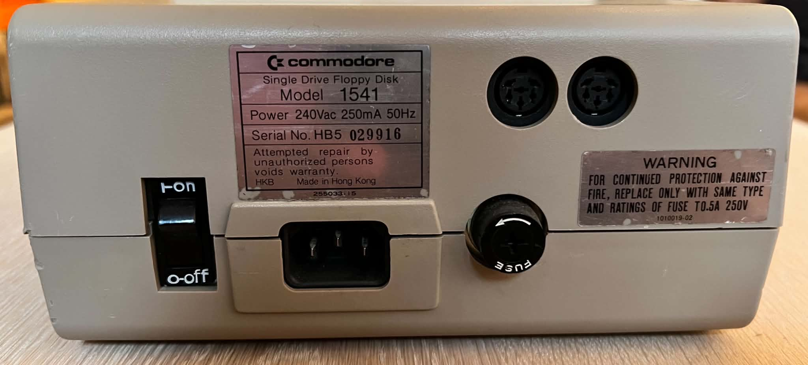
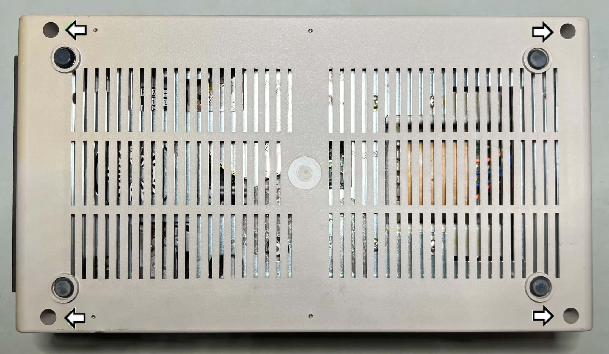
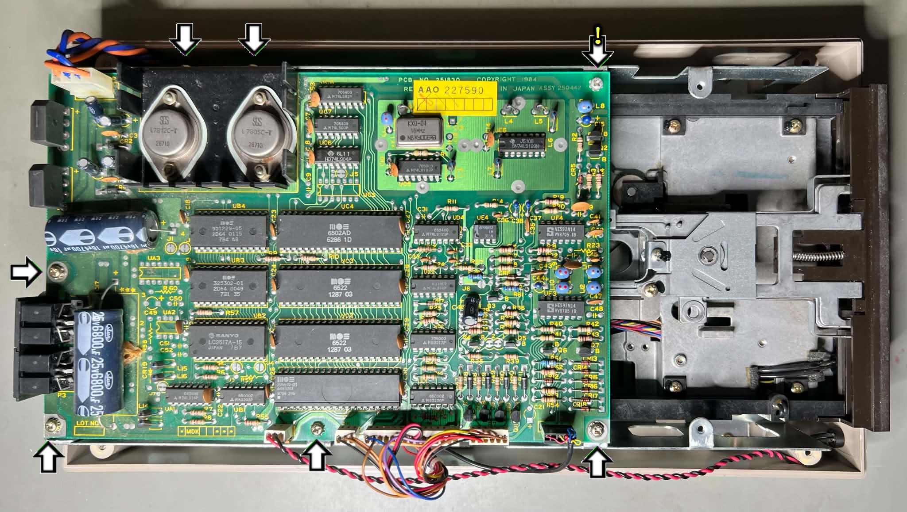
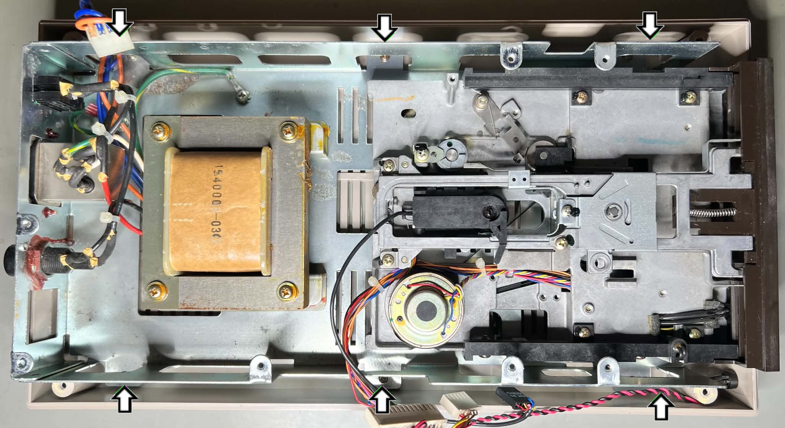
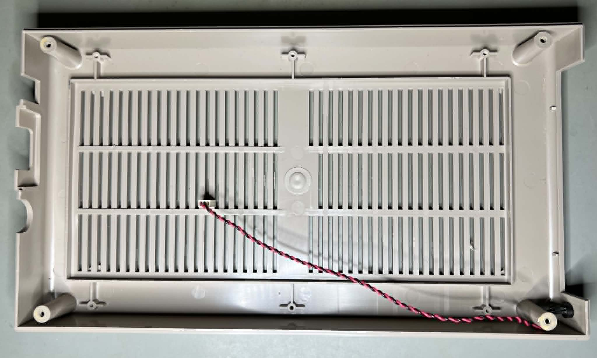

    

# Commodore 1541

 

# Table of contents

<!-- TABLE OF CONTENTS -->

TOC - Click to enlarge

  <ul>
    <li>
      <a href="#starting-point">Starting point</a>
    </li>
    <li>
      <a href="#refurbish-activities">Refurbish activities</a>
    </li>
    <li>
      <a href="#disassembly">Disassembly</a>
    </li>
  </ul>

# Starting point

This nice-looking Commodore 1541 Single Drive Floppy Disk is in for some TLC, but also to have a Dolphin DOS 3 speeder installed. It is expected to be fully working from the start, but it will be tested thoroughly during the refurbishment.

It appears to be in good condition. I cannot see any signs of damage. There are some occasional marks, but nothing serious. There are signs of some dust on the inside, but very little.

Also, this is, in my opinion, the "right" version of the Commodore 1541 floppy drive. The characteristic front with the closing lid indicates that this 1541 drive is built with the ALPS drive mechanism. The ALPS drive mechanism is more likely to have a working R/W head.

Below are some pictures of the drive before refurbishment.

    
    
    
    
    
    

# Refurbishment activities

The planned refurbishment activities for this Commodore 1541 Single Drive Floppy Disk (order may vary; several activities may be performed in parallel):

- [ ]Refurbish the mainboard
- [ ]Refurbish the casing
- [ ]Refurbish the internal mechanics
- [ ]Install the Dolphin DOS 3.0 speeder
- [ ]Testing and validation

The plan may be updated during the refurbishment process. Sometimes I discover areas that need special attention.

# Disassembly

The first step in disassembling the Commodore 1541 floppy drive is to remove the four Phillips machine screws[^1] on the bottom.

    

The drive is flipped back over, and the top cover is removed. This reveals the mainboard and parts of the internal mechanics.

    

The next step is to remove the mainboard from the drive. There are seven Phillips machine screws[^2] holding the mainboard to the bottom chassis (see arrows in the picture above). Note that two of these screws are located on the large heat sink for the voltage regulators. Also, there is a tooth washer for each of the seven screws.

Before the mainboard can be lifted, the connectors at P4, P5, P6, and P7 must be disconnected.

With the mainboard out of the way, the entire internal mechanism is exposed.

    

Now the inner tray is lifted from the bottom cover. This is done by removing the six Phillips screws[^3] located on each side of the tray (see arrows in the picture above). Below is a picture of the remaining bottom cover.

    

<!-- MARK -->

<!-- MARK END-->

**Footnotes**
[^1]: Phillips pan head (5.2 mm), Machine screw, Fully threaded, Thread diameter: 3.0 mm, Fastener length: 7.5 mm
[^2]: Phillips pan head (5.2 mm), Machine screw, Fully threaded, Thread diameter: 3.0 mm, Fastener length: 5.5 mm (and tooth washer)
[^3]: Phillips pan head (5.2 mm), Sheet metal screw, Fully threaded, Thread diameter: 3.0 mm, Fastener length: 9.6 mm

