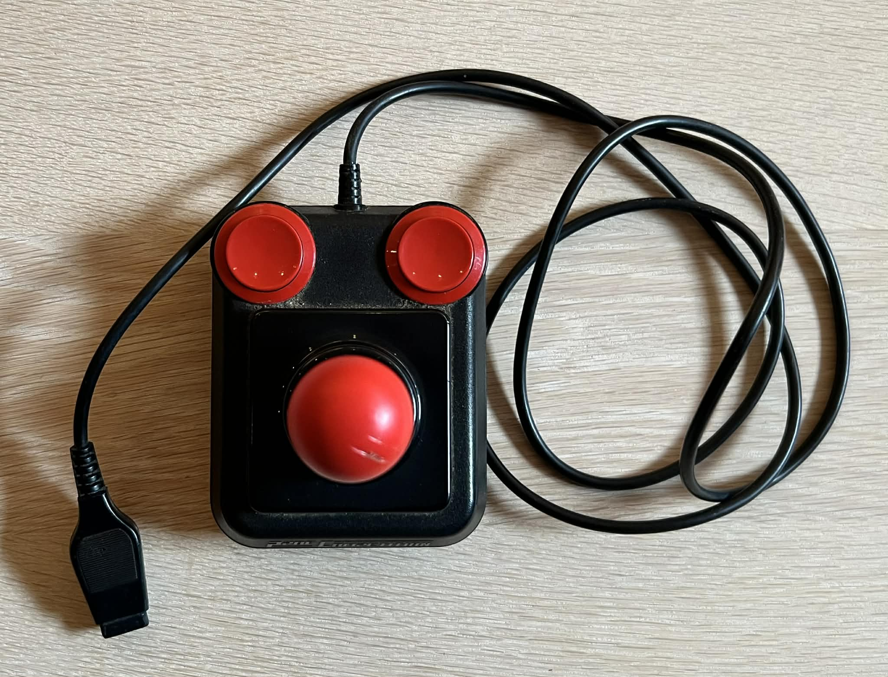
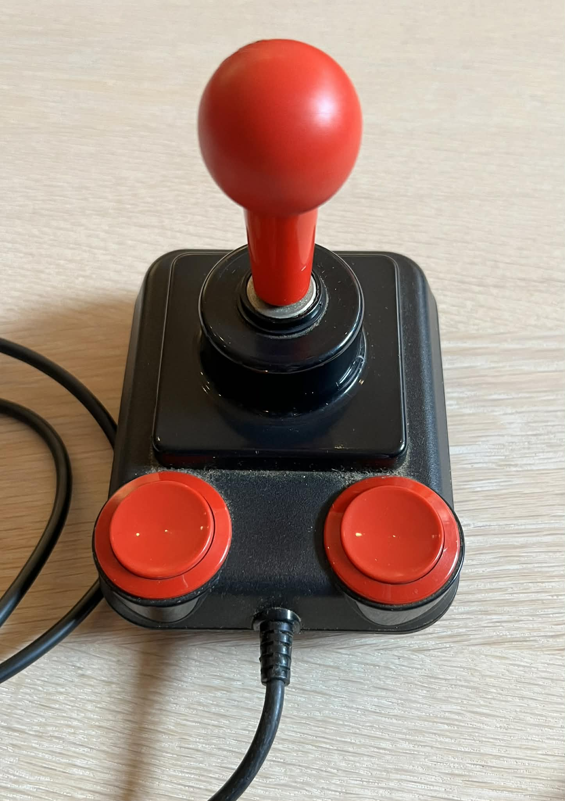
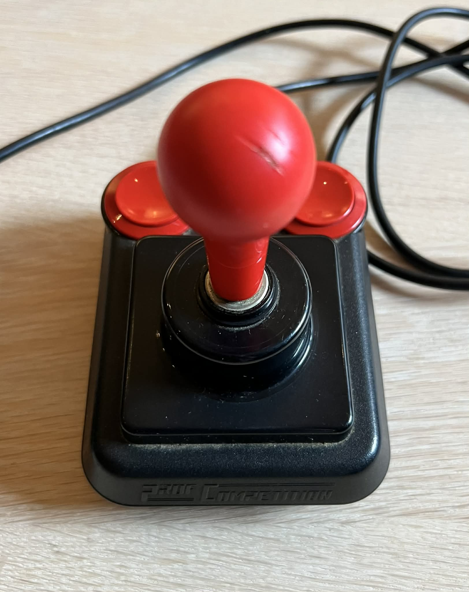
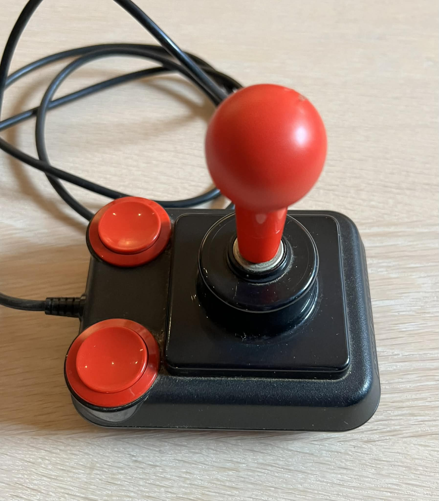
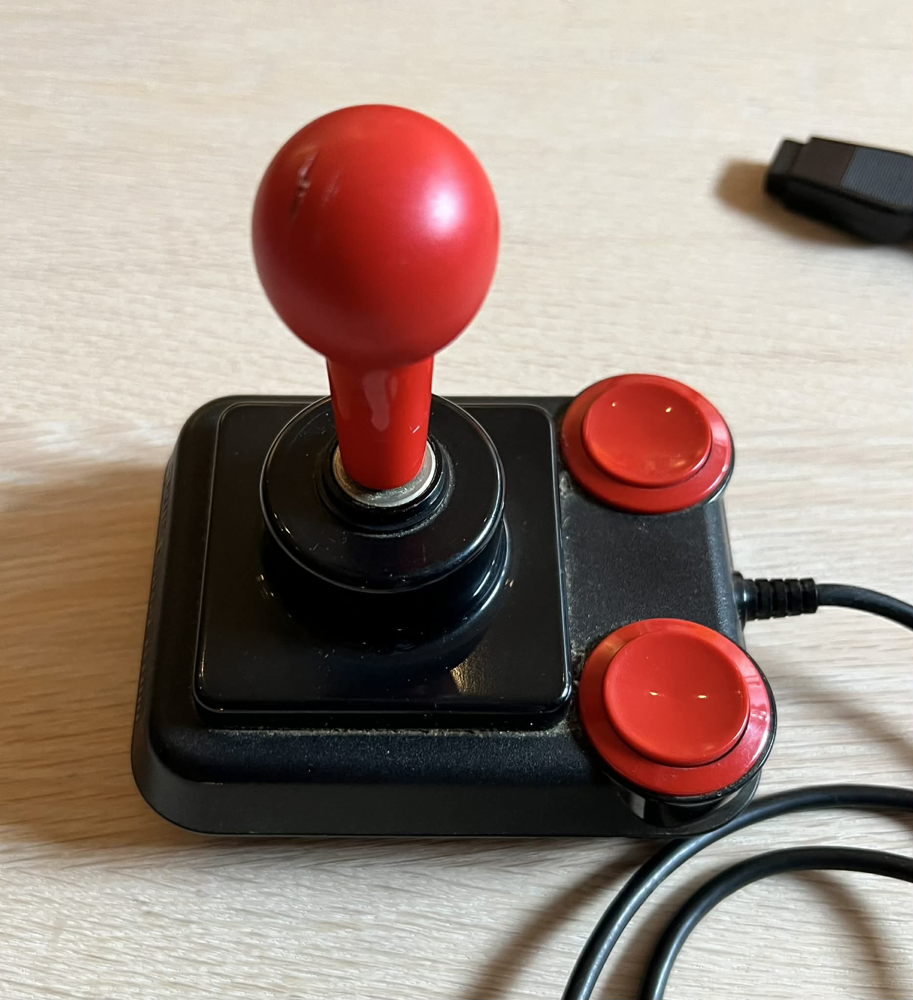
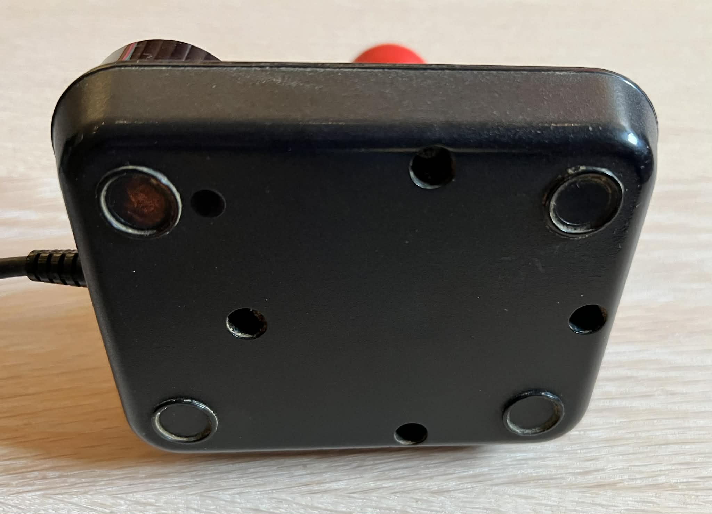
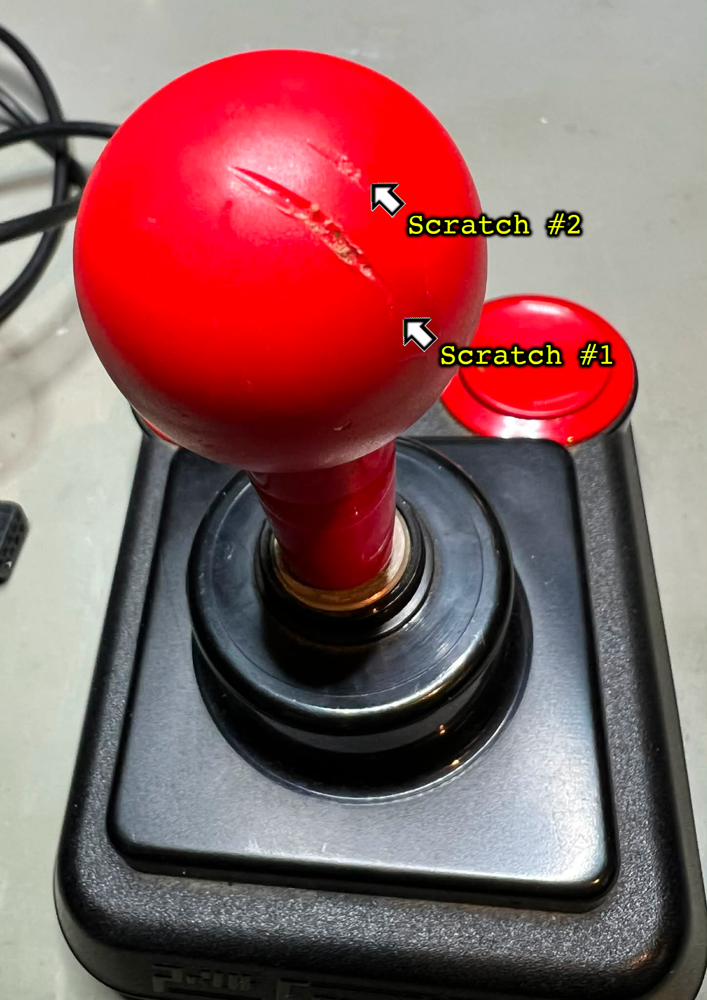
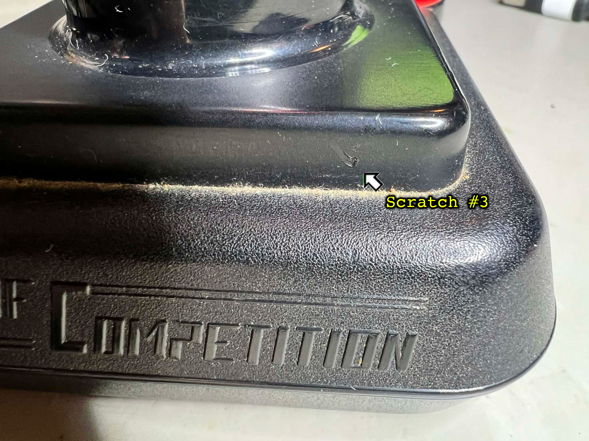
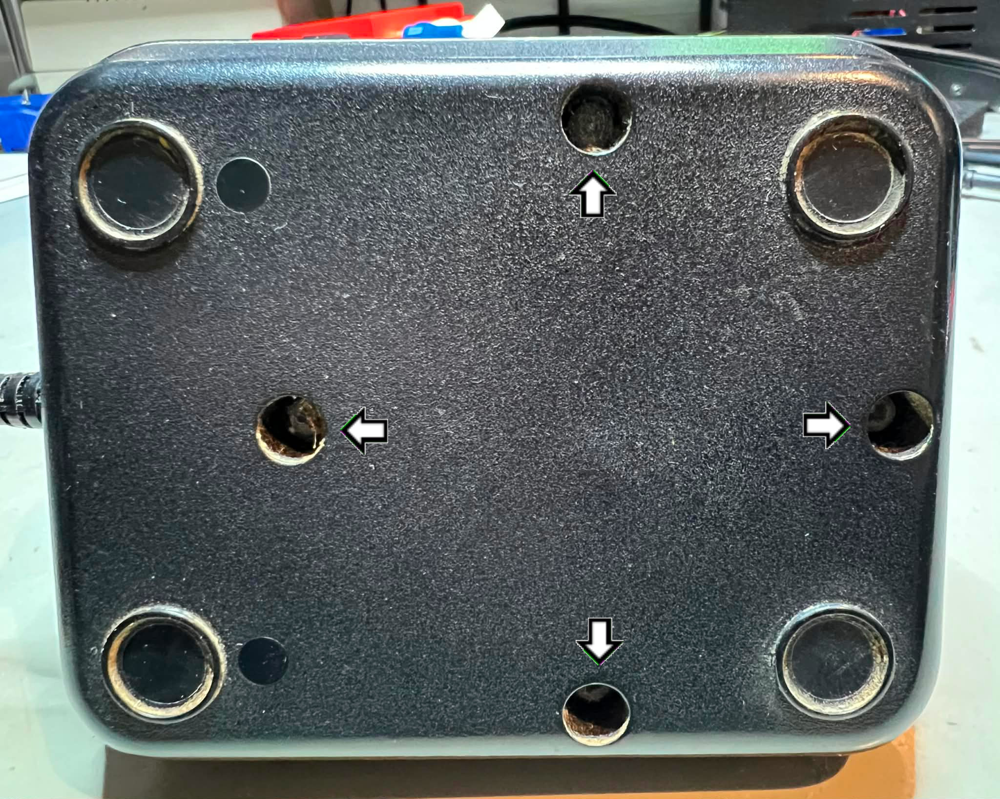

    

 

# Table of contents

<!-- TABLE OF CONTENTS -->

TOC - Click to enlarge

  <ul>
    <li>
      <a href="#starting-point">Starting point</a>
    </li>
    <li>
      <a href="#refurbish-activities">Refurbish activities</a>
    </li>
    <li>
      <a href="#disassembly">Disassembly</a>
    </li>
  </ul>

# Starting point

At first glance this looks very much like a normal Competition Pro joystick (see [here](https://refurbished-commodore.com/comppro-007) for an example). But with closer inspection this is a Prof Competition joystick by Suzo International which is the manufacturer of the famous "The Arcade" joystick. Later versions of the Prof Competition joystick have a different design for the two fire buttons (see [here](https://refurbished-commodore.com/profcomp-001) for an example). Could it be that the Prof Competition by Suzo International was looking too similar as the Competition Pro - forcing Suzo to change the design later?

The joystick appears to be in quite ok condition - with one exception: there are some severe scratches on the ball top. These scratches does not degrade the functional quality of the joystick in any way, but it affects the cosmetic appearance. The joystick is very dirty. The pictures doesn't do justice - it is actually more dirty than it looks. There is a thick layer of dust and grease all around the casing and shaft. Also, there is a small scratch at the middle "base" (rear - just above the logo), but this is more or less insignificant. 

All of the four rubber feet are gone I would assume. I can´t tell for sure if there was rubber feet originally, but I think it is a fair guess. There are residue which looks like glue where the pads should be, and other versions of the Prof Competition have rubber feet.

One thing I notice, and really enjoy, is the "feel" of the shaft when moving the UP/DOWN/LEFT/RIGHT direction. It feels very firm and give the very nice "clicky" sound from the microswitches. 

The joystick cable, connector and strain relief appear to be in good condition. The connector is a bit worn, but that is to be expected and completely normal.

All the four screws at the bottom cover are present. They are quite corroded, but this is also to be expected after 30-40 years. 

Below are some pictures of the joystick before refurbish (click to enlarge).

    
    
    
    
    
    

Close up pictures of the three visible scratches (click to enlarge).

    
    
    

# Refurbish activities

The planned refurbishment activites for this Prof Competition joystick (Order may vary. Several of them in parallell):

- [ ] Refurbish casing
- [ ] Refurbish the interior electronics
- [ ] Refurbish the cable and connector
- [ ] Testing and validation

The plan can be updated during the refurbishment process. Sometimes I discover areas that needs special attention.
 

# Disassembly

To start disassemblig the Prof Competition joystick the four Phillips screws [^1] at the bottom are removed with a low torque screwdriver.

    

As previously mentioned, the screws are quite oxidized after many years. To fix this the screws are soaked in WD-40 oil for several days - wrapped in some plastic film. This removes most of the oxidation. 

**Footnotes**
[^1]: Phillips pan head (5.5mm), Sheet metal screw, Fully threaded, Thread diameter: 3.0 mm, Fastener length: 16.0 mm

